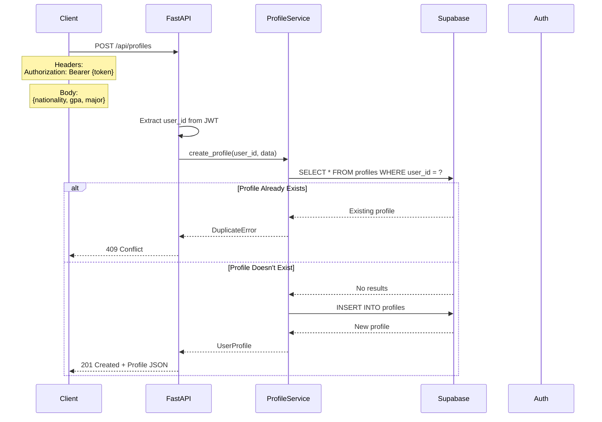
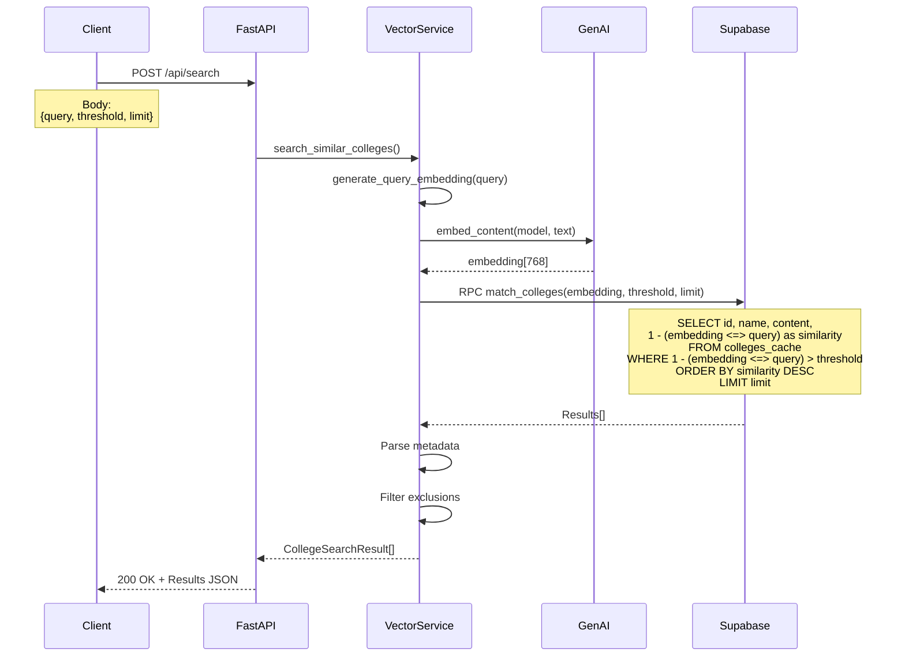
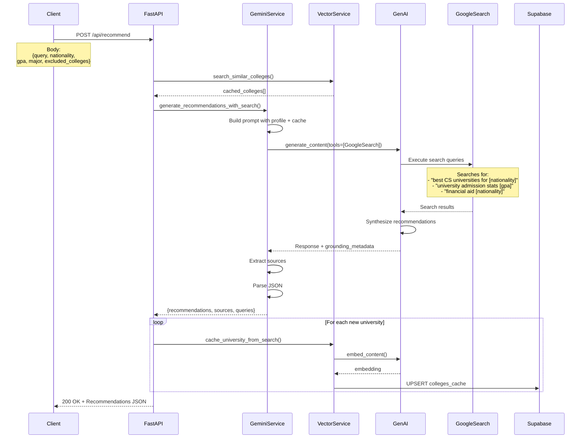
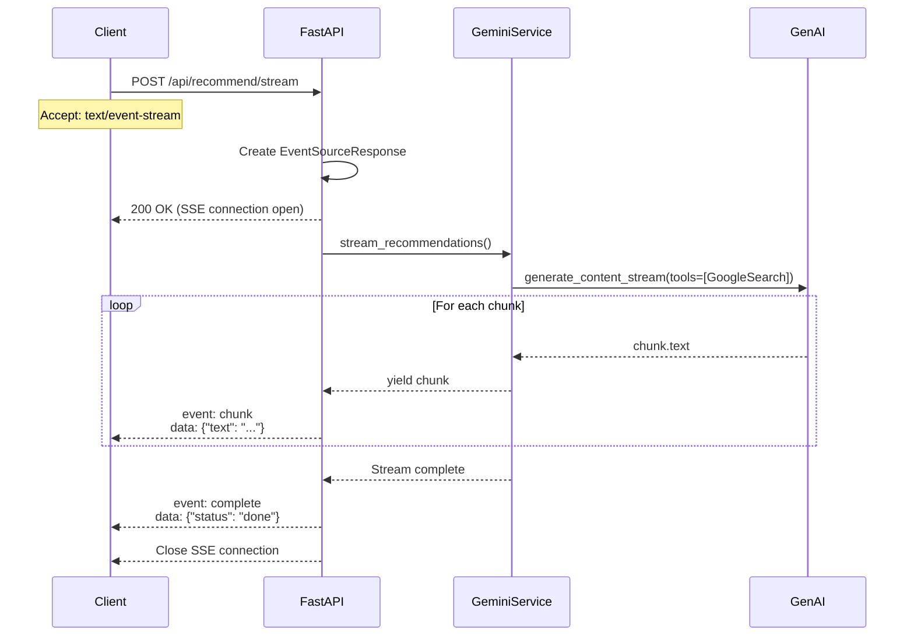
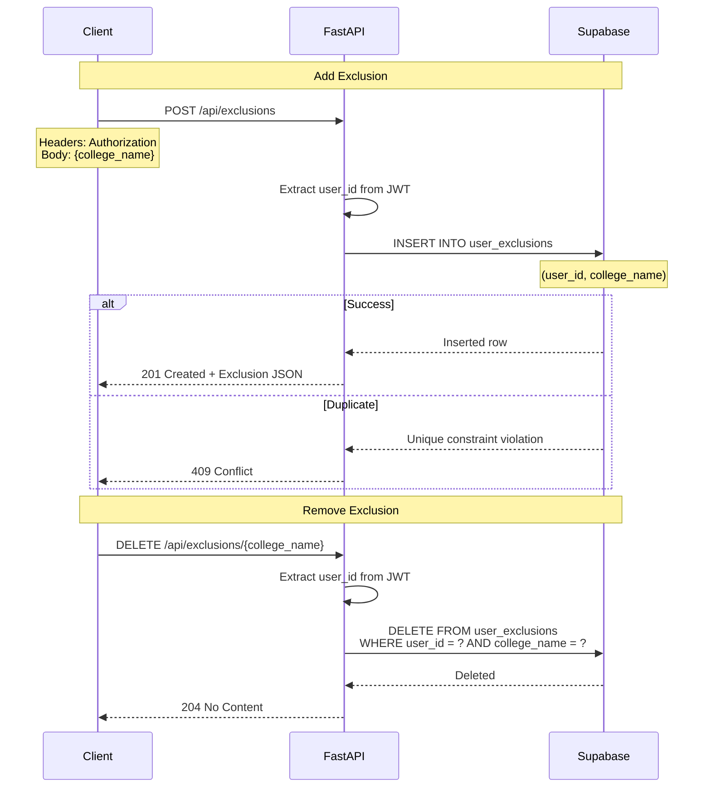
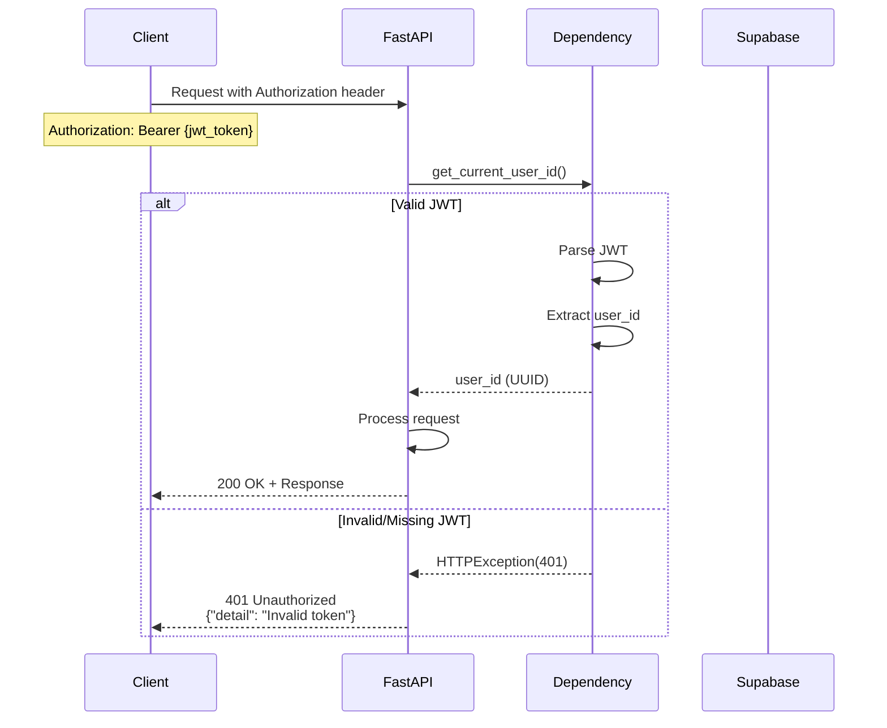
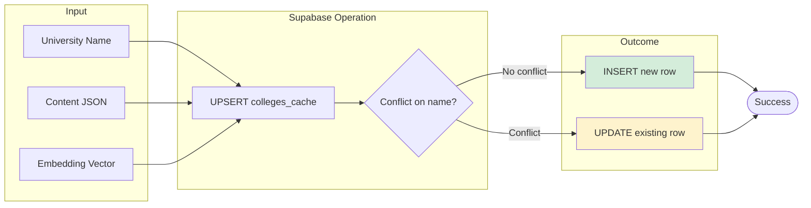
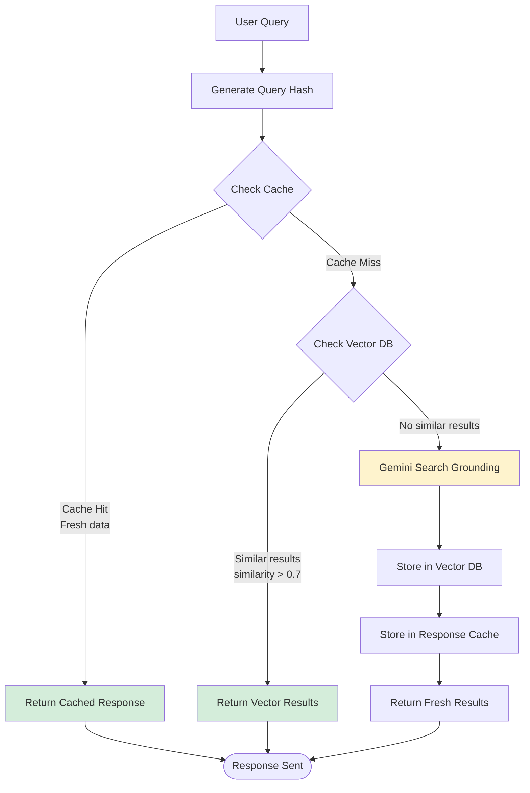

# College List AI - API Flow Documentation

## API Request/Response Flows

### 1. Profile Creation Flow



---

### 2. Vector Search Flow



---

### 3. AI Recommendation with Search Grounding



---

### 4. SSE Streaming Flow



---

### 5. Exclusion Management Flow



---

## Error Handling Flows

### 6. Rate Limit Handling

```mermaid
flowchart TD
    Request[API Request] --> Service[Service Layer]
    
    Service --> APICall[Call External API]
    APICall --> Response{Response Status}
    
    Response -->|200 OK| Success[Return Data]
    Response -->|429 Rate Limit| Retry{Retry Count < 3?}
    
    Retry -->|Yes| Wait[Exponential Backoff<br/>1s, 2s, 4s]
    Wait --> APICall
    
    Retry -->|No| RateLimitError[Throw RateLimitError]
    
    RateLimitError --> Handler[Exception Handler]
    Handler --> LogError[Log Error]
    LogError --> Response429[Return 429 JSON]
    
    Response429 --> Client[Client Receives Error]
    Client --> Display[Display: "Too many requests.<br/>Please try again later."]
    
    style Wait fill:#fef3cd
    style RateLimitError fill:#f8d7da
```

---

### 7. Authentication Flow



---

## Database Interaction Flows

### 8. Vector Similarity Search (SQL)

```mermaid
flowchart TD
    Input[Query Embedding] --> RPC[RPC: match_colleges]
    
    RPC --> SQL[SQL Function Execution]
    
    SQL --> Compute[Compute Cosine Similarity<br/>1 - (embedding <=> query_embedding)]
    
    Compute --> Filter[Filter by threshold<br/>similarity > match_threshold]
    
    Filter --> Sort[ORDER BY similarity DESC]
    Sort --> Limit[LIMIT match_count]
    
    Limit --> Return[RETURN TABLE<br/>(id, name, content, similarity)]
    
    Return --> Results[Results to Application]
    
    style Compute fill:#e8f4f8
    style Filter fill:#e8f4f8
```

---

### 9. Cache Upsert Flow



---

## Performance Optimization Flows

### 10. Caching Strategy


