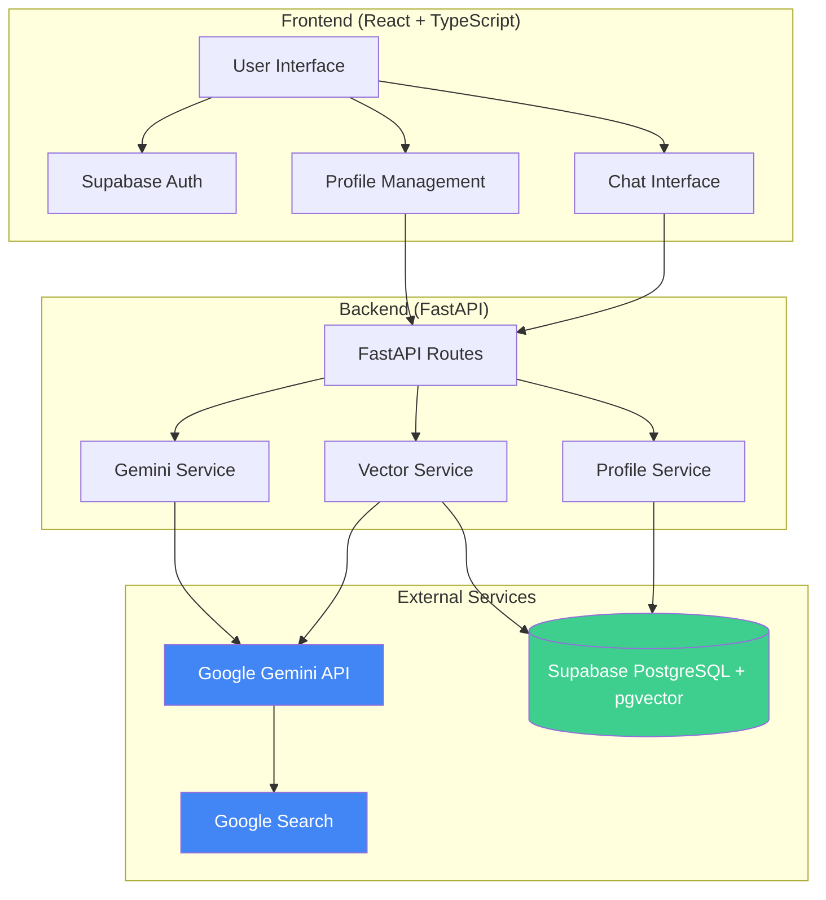
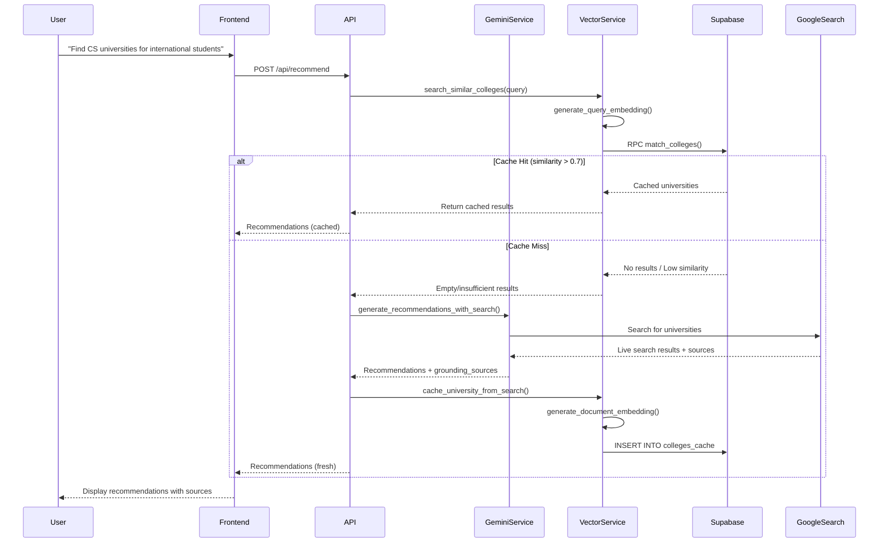
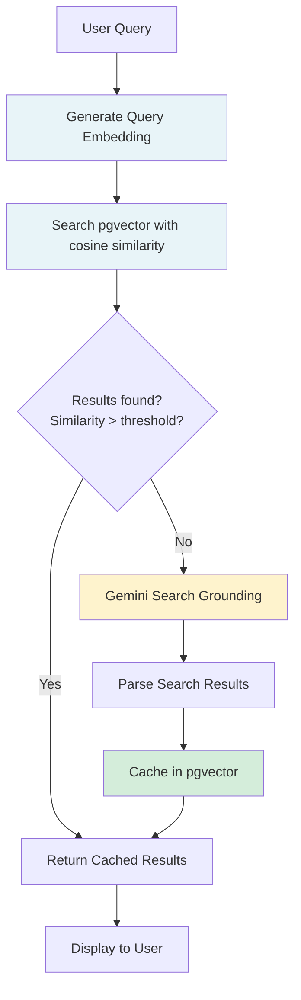
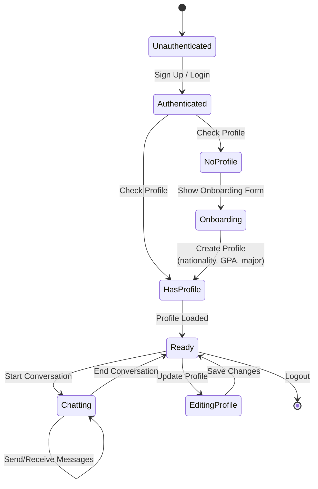
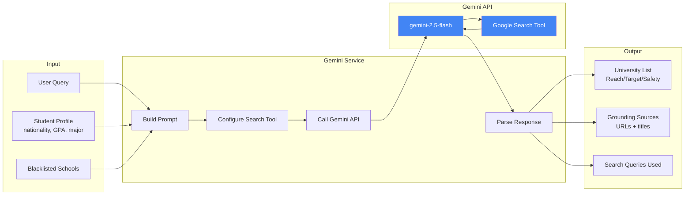
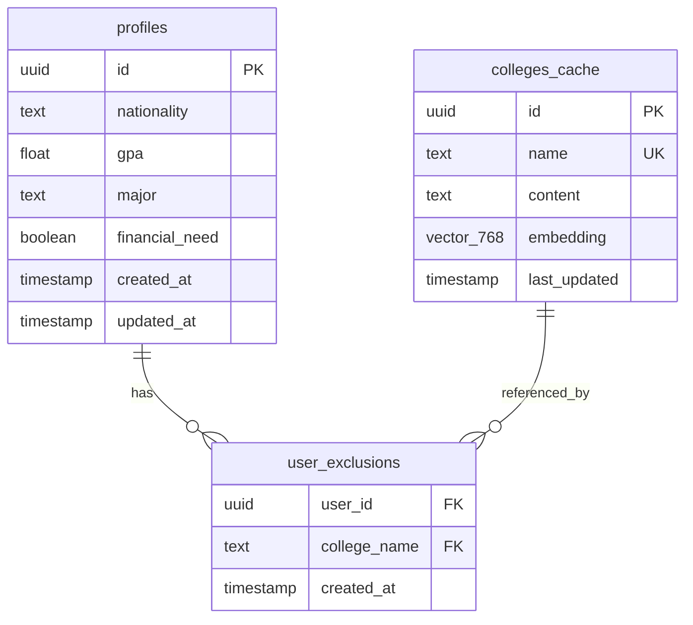

# College List AI - Architecture Documentation

## System Overview

College List AI is an intelligent college advisor that uses Gemini's Search Grounding to find universities and caches results in a vector database to minimize API costs.

---

## High-Level Architecture



---

## Data Flow: University Recommendation



---

## Vector Search Flow



---

## Profile Management Flow



---

## Gemini Service: Search Grounding



---

## Database Schema



---

## API Endpoints

### Profile Management
```
GET    /api/profiles/me          # Get current user profile
POST   /api/profiles             # Create profile
PATCH  /api/profiles/me          # Update profile
DELETE /api/profiles/me          # Delete profile
```

### Search & Recommendations
```
POST   /api/search               # Vector similarity search
POST   /api/recommend            # AI recommendations (JSON)
POST   /api/recommend/stream     # AI recommendations (SSE)
GET    /api/exclusions           # Get blacklist
POST   /api/exclusions           # Add to blacklist
DELETE /api/exclusions/{name}    # Remove from blacklist
```

---

## Technology Stack

```mermaid
graph LR
    subgraph "Frontend"
        React[React 18]
        TS[TypeScript]
        Vite[Vite]
        Supabase_JS[@supabase/supabase-js]
    end
    
    subgraph "Backend"
        FastAPI[FastAPI]
        Python[Python 3.10+]
        Pydantic[Pydantic v2]
        GenAI[google-genai]
    end
    
    subgraph "Database"
        PostgreSQL[PostgreSQL 15+]
        pgvector[pgvector extension]
    end
    
    subgraph "AI/ML"
        Gemini[Gemini 2.5 Flash]
        Embedding[text-embedding-004]
        SearchAPI[Google Search API]
    end
    
    React --> Supabase_JS
    FastAPI --> GenAI
    FastAPI --> Pydantic
    GenAI --> Gemini
    GenAI --> Embedding
    Gemini --> SearchAPI
    FastAPI --> PostgreSQL
    PostgreSQL --> pgvector
```
