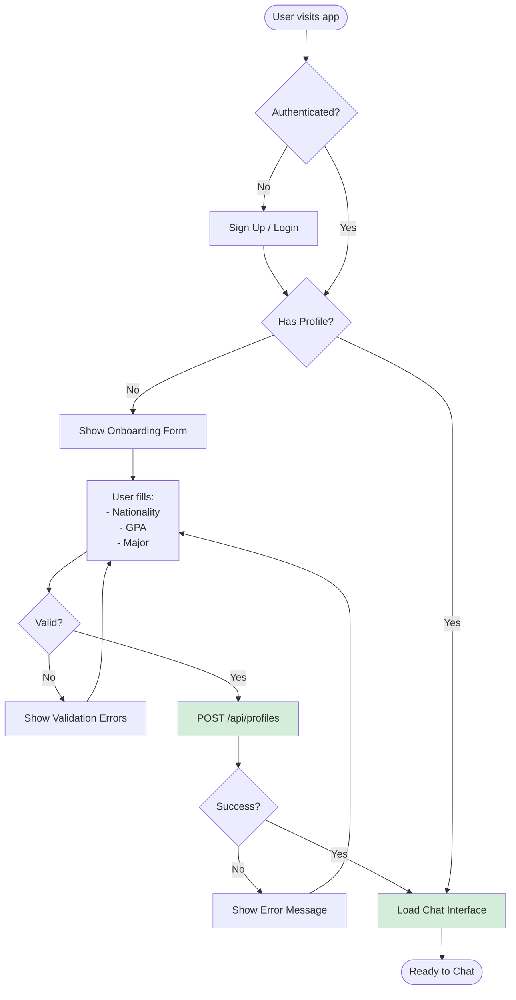
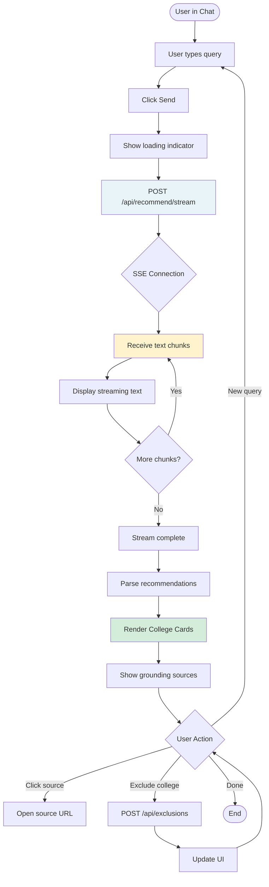
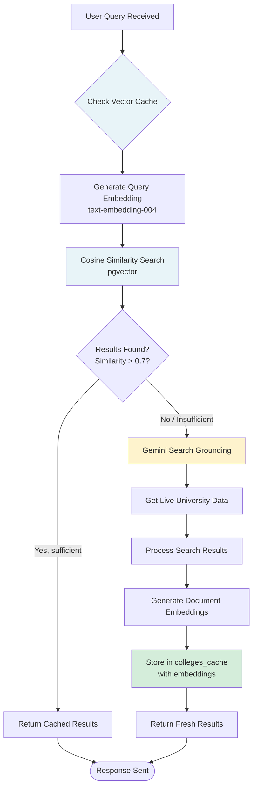
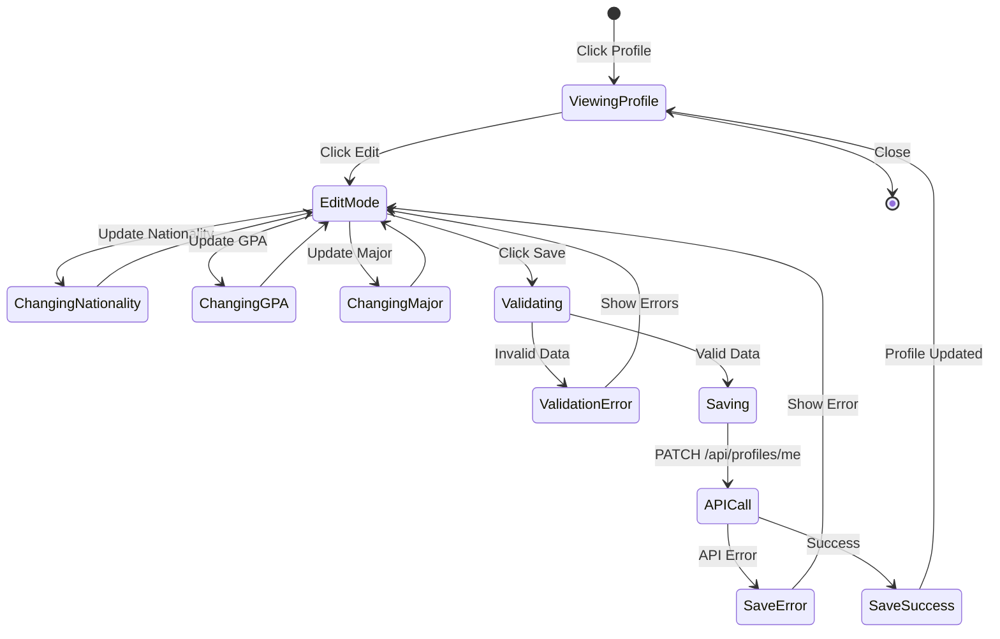
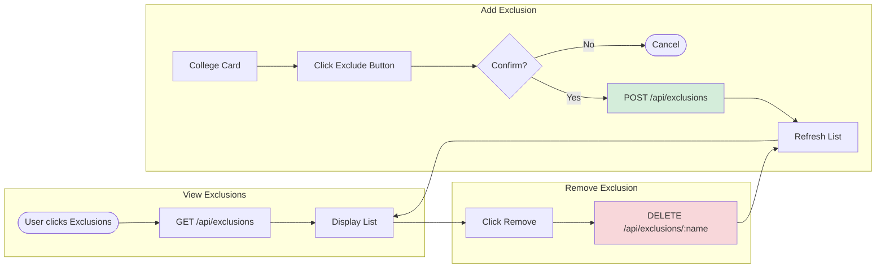
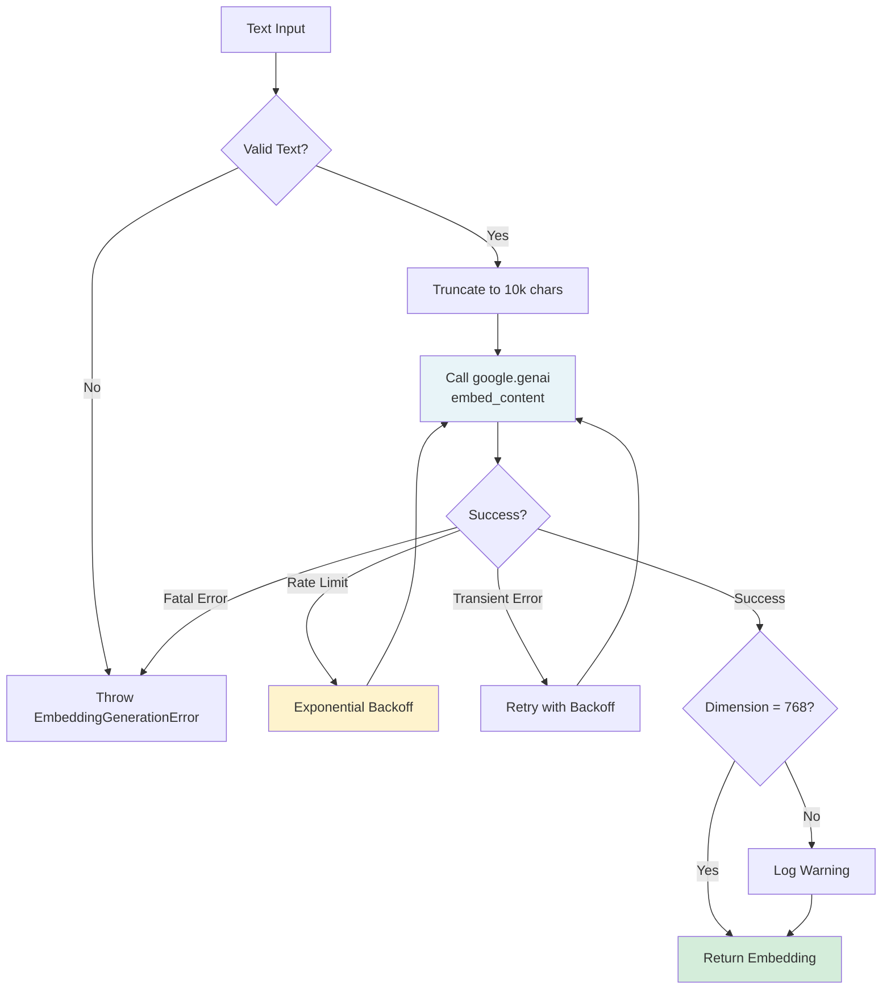
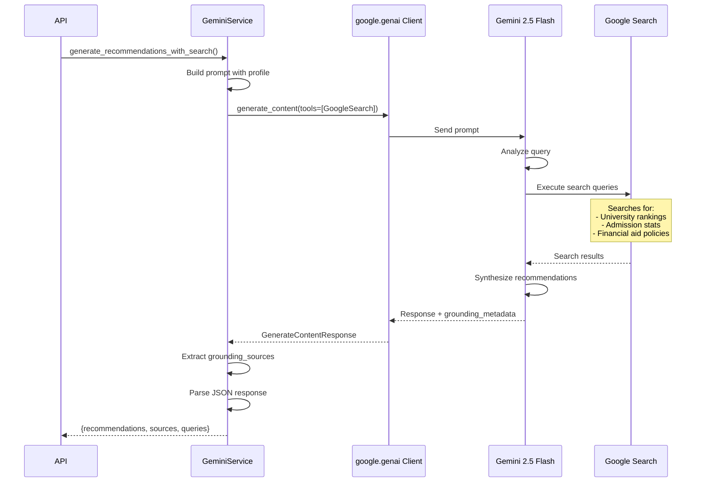
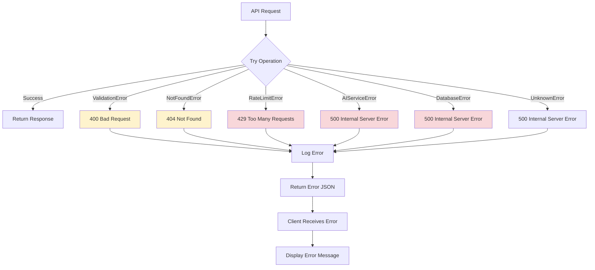
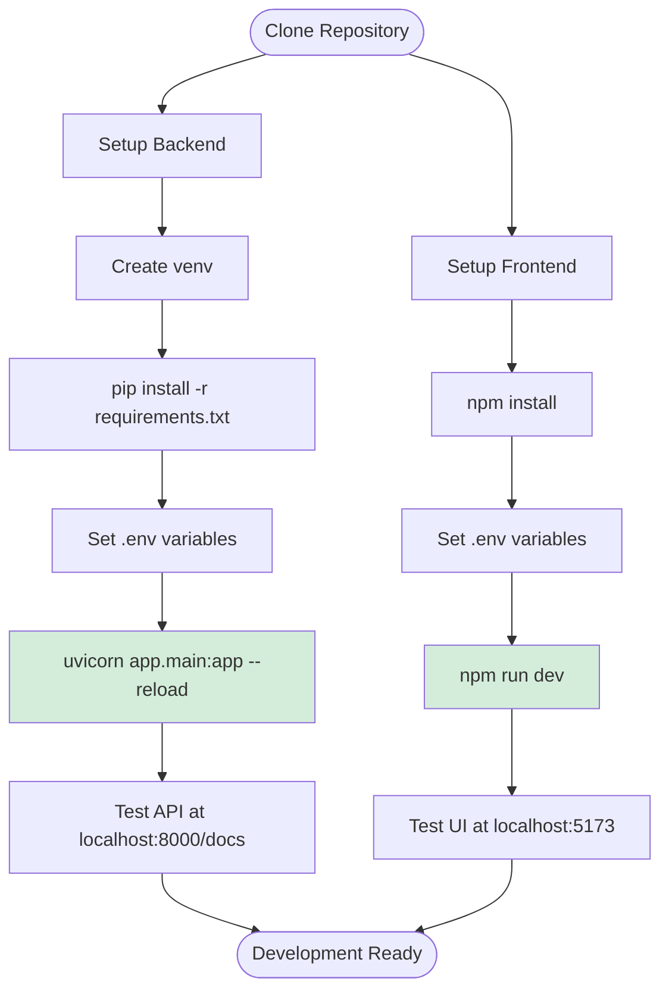
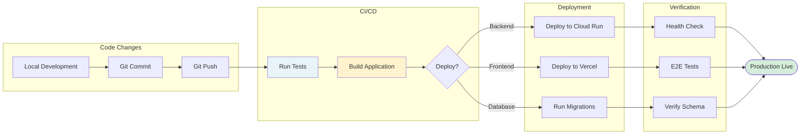

# College List AI - Workflow Documentation

## User Workflows

### 1. New User Onboarding

---

### 2. University Search & Recommendation

---

### 3. Cache Management Workflow

---

### 4. Profile Update Workflow

---

### 5. Exclusion Management

---

## Backend Workflows

### 6. Embedding Generation Workflow

---

### 7. Search Grounding Workflow

---

### 8. Error Handling Workflow

---

## Development Workflows

### 9. Local Development Setup

---

### 10. Deployment Workflow

